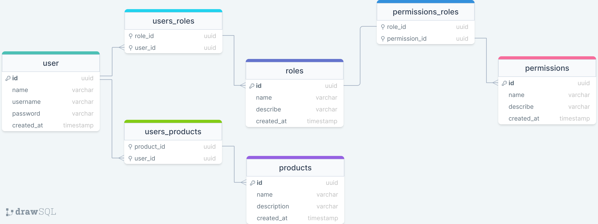

# Permissions Users
🌐 _Para a versão em português deste README, [clique aqui](./docs/locales/pt-br/README.md)._


<p align="center">
    This project was developed with the objective of creating user access control, using NodeJS by <a href="https://github.com/EuCarlos">@EuCarlos</a><br>
    
    
    
    
</p>

## Summary
- [1. Installation:](#1-installation)
- [2. Run the project](#2-run-the-project)
- [3. Documentation](#3-documentation)
- [4. About project](#4-about-project)
    - [4.1 Functional requirements](#41-functional-requirements)
    - [4.2 Data modeling](#42-data-modeling)
- [5. How to contribute to this project?](#4-how-to-contribute-to-this-project)
- [6. How do I report a bug or request a feature?](#5-how-do-i-report-a-bug-or-request-a-feature)

## 1. Installation:
Clone the repo and Install dependencies using Yarn:
```bash
git clone https://github.com/EuCarlos/permissions-users.git \
  && cd permissions-users \
  && yarn install
```
### 2. Run the project
First run migration
```bash
yarn typeorm migration:run
```
Then run as developer
```bash
yarn dev
```
## 3. Documentation
All route information has been documented with **Swagger UI**, and can be found in the `/api/v1/docs` route

## 4. About project

### 4.1 Functional requirements:
- [**FR001**] - The system should register users.
- [**FR002**] - The system should authenticate users.
- [**FR003**] - The system should register permissions.
- [**FR004**] - The system should register roles.
- [**FR005**] - The system should register products.

### 4.2 Data modeling
<p align="center">

</p>

## 5. How to contribute to this project?
Before starting, check and follow the instructions for contributing to the repository. If not, you can follow the instructions below:

1. Fork the project
2. Create a new branch: git checkout -b nova-branch
3. Commit your changes: git commit -m 'I added something'
4. Push to branch: git push origin nova-branch
5. Open a Pull Request

## 6. How do I report a bug or request a feature?
If you want to report a bug or request a feature, go to [Issue](https://github.com/eucarlos/permissions-users/issues) on the GitHub Project and add your request.

___

<p align="center">
Created with 💜 by <a href="https://github.com/eucarlos/">Carlos Alves</a></p>
